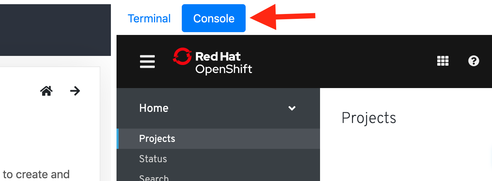
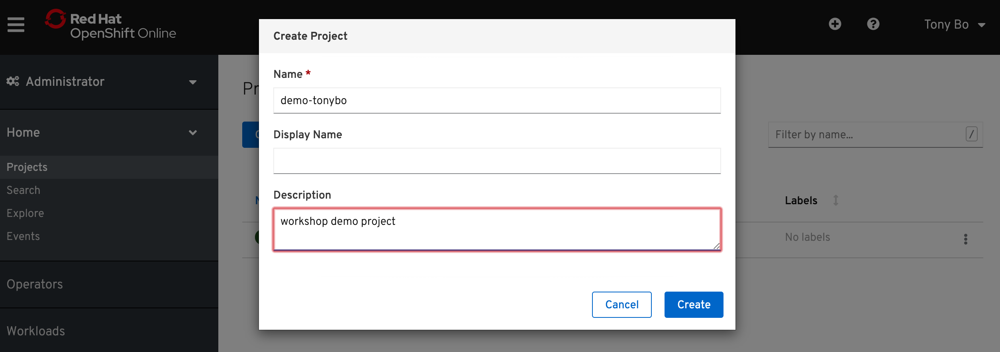
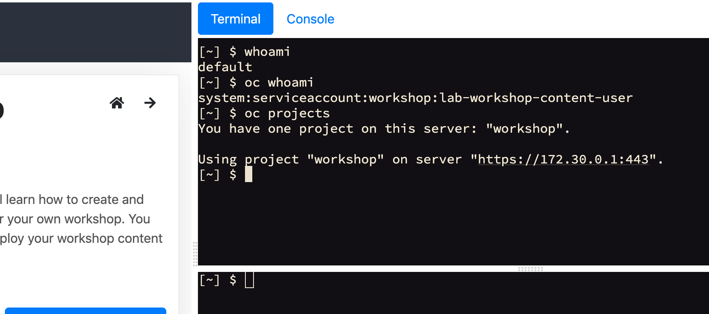

#### Welcome to Openshift 4

This lab provides a quick tour of the new console to help you get familiar with the user interface along with some key terminology we will use in subsequent lab content. 
<br>

#### Key Terms

We will be using the following terms throughout the workshop labs so here are some basic definitions you should be familiar with. You'll learn more terms along the way, but these are the basics to get you started.

+ Container - Your software wrapped in a complete filesystem containing everything it needs to run

+ Image - We are talking about docker images; read-only and used to create containers

+ Pod - One or more docker containers that run together

+ Service - Provides a common DNS name to access a pod (or replicated set of pods)

+ Project - A project is a group of services that are related logically

+ Deployment - an update to your application triggered by a image change or config change

+ Build - The process of turning your source code into a runnable image

+ BuildConfig - configuration data that determines how to manage your build

+ Route - a labeled and DNS mapped network path to a service from outside OpenShift

+ Master - The foreman of the OpenShift architecture, the master schedules operations, watches for problems, and orchestrates everything

+ Node - Where the compute happens, your software is run on nodes

<br>

#### Accessing OpenShift

OpenShift provides a web console that allows you to perform various tasks via a web browser. Additionally, you can utilize a command line tool to perfrom tasks. Let's get started by logging into both of these and checking the status of the platform.

<br>

#### Workshop Tabs

To the rightside of this window will be a terminal tab to allow you to execute commands against the Openshift CLI and a tab to allow you to access the web console. 

Click on the Web Console and it should show you the Projects page of the Openshift Dashboard.



<br/>

#### Create a new project

First let's create a new project to do our workshop work in. 

Click on the ```Create Project``` button and give it a name of 

```
demo-%username%
``` 

Populate the ```Description``` box with whatever you like and click ```Create```:



<br>

#### Let's try the command line (CLI)

Navigate over to the Terminal tab.



You can type out these commands below or click on the play button on the right side to execute them in the terminal:

Check Openshift Version:

```execute
oc version
```

Check Openshift Status:

```execute
oc status
```

Show Openshift Projects that you have access to:

```execute
oc get projects
```

Now, set the project, ```demo-%username%```, that you created earlier to be your working project in the cli

```execute
oc project demo-%username%
```

<br>
#### Some other cli commands to know about:

This is the equivalent of creating a new project, as you did previously in the web console:
```
oc new-project demo-%username%
```

Great! Things you did in lab 1 were:

1. Navigating to the web console
2. Creating a project inside the web console
3. Using the CLI to control the Openshift environment

<br>

Click continue to move to Lab 2.
