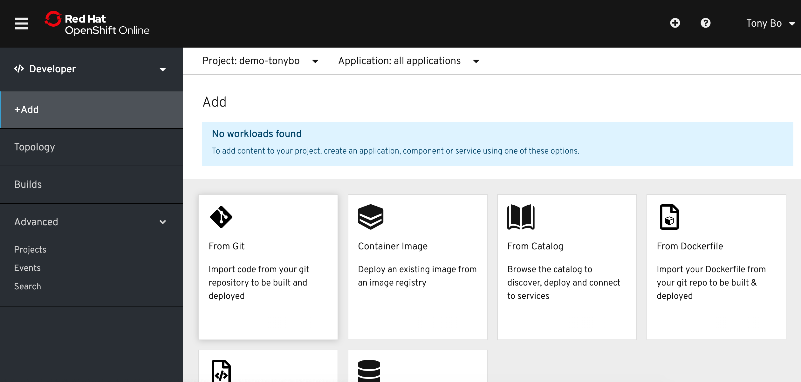
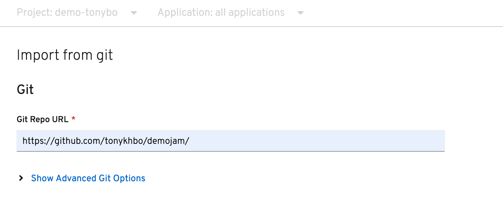
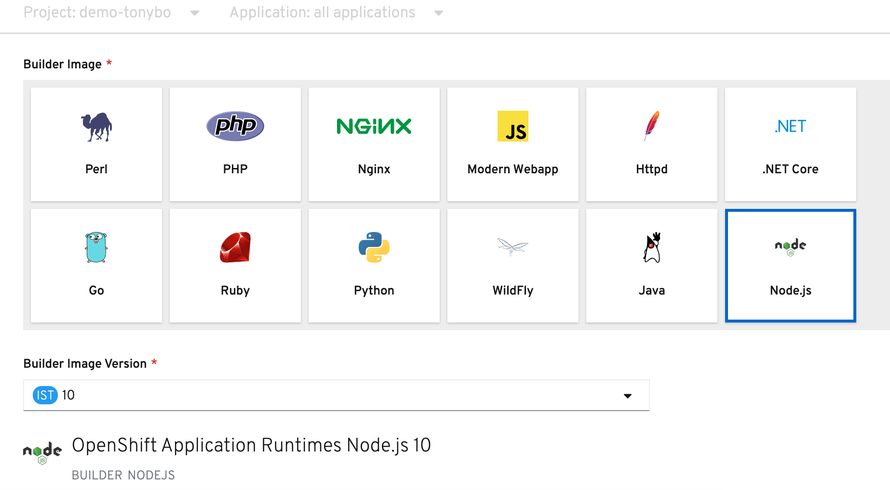
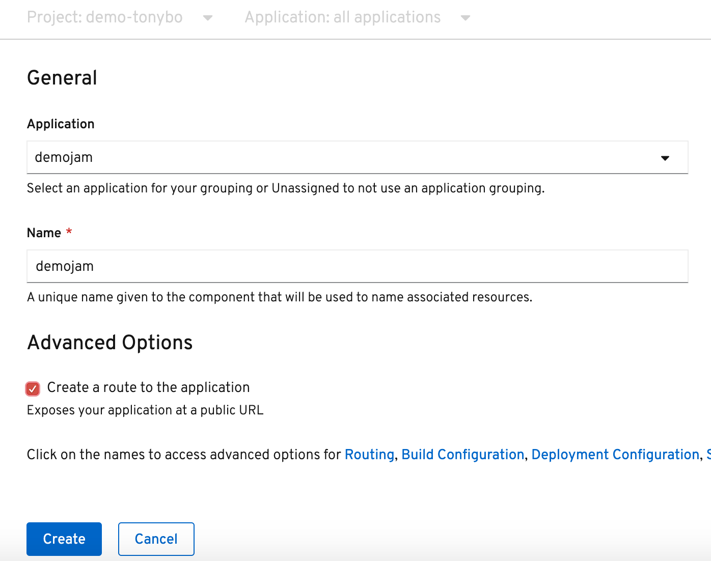
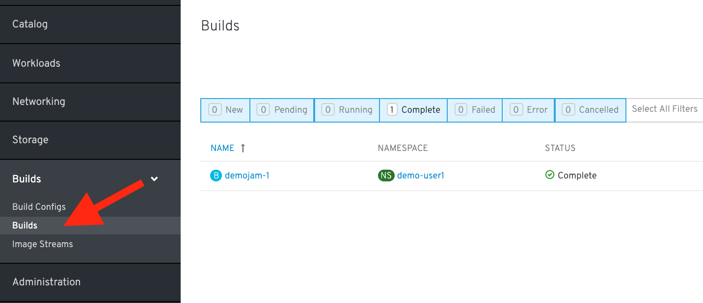
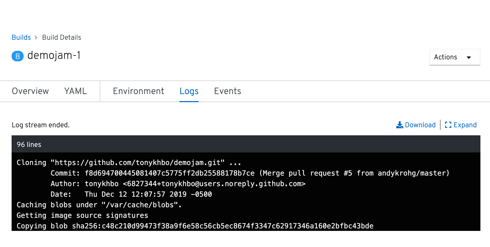
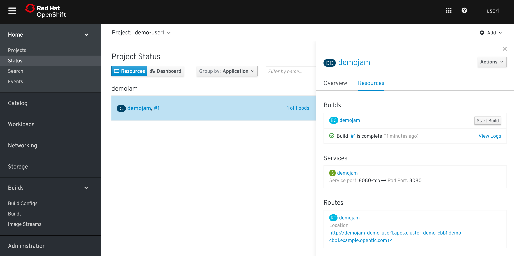
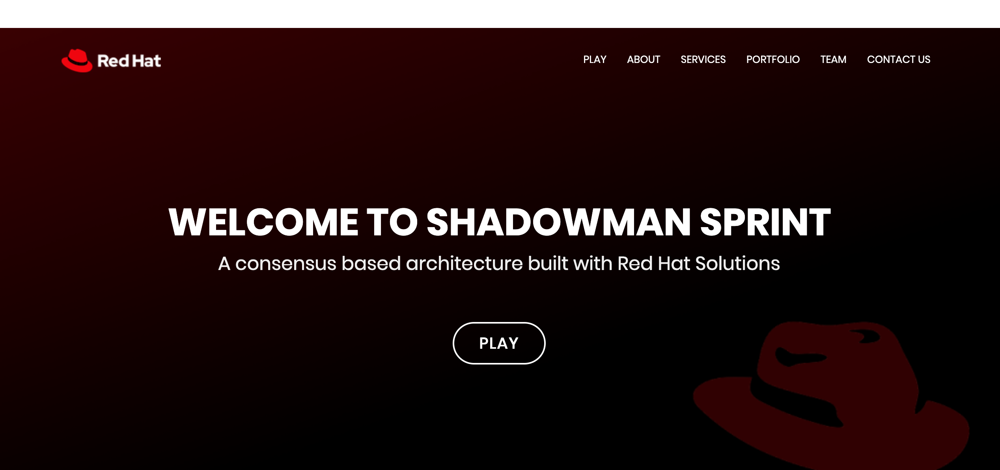

### Source to Image

One of the useful components of OpenShift is its source-to-image capability. S2I is a framework that makes it easy to turn your source code into runnable images. The main advantage of using S2I for building reproducible docker images is the ease of use for developers. You'll see just how simple it can be in this lab.
<br>
<br>
When going through this lab, follow either Option 1 (CLI Instructions) or Option 2 (Web Console Instructions).

#### Let's build a node.js web server using S2I

<br>

##### CLI Instructions (Option 1)

Deploy a new application from Github by running the following commands in the terminal:

```execute
oc new-app --name=demojam https://github.com/tonykhbo/demojam.git
```

<br>
Create a route for the new app:

```execute
oc expose service demojam
```

<br>

##### Web Console Instructions (Option 2)

Navigate to the Developer View, click on +Add, and then click on "From Git" in the available options:



Copy the following url and paste it into the Git Repo URL input bar:

```
https://github.com/tonykhbo/demojam.git

```



Select NodeJS as one of the builder options and set the Builder Image version to 10:



Set the Application and Name for your project as demojam, leave the rest as default, and click "Create":



#### Check out the build details

We can see the details of what the S2I builder did. This can be helpful to diagnose issues if builds are failing.

<br>

##### CLI Instructions (Option 1)

At the terminal, run the following commands:

```execute
oc get builds
```

<br>

Note the name of your build from the above command output and use it to see the logs with:

```
oc logs builds/[BUILD_NAME]
```

<br>

##### Web Console Instructions (Option 2)

In the Administrator View, expand Builds on the left hand side, and click on "Builds". Click on demojam:



Click on Logs to see the details of your latest build. You'll see a similar log output as the one below:



#### See the App in Action
Let's see this app in action!

<br>

##### CLI Instructions (Option 1)

In the terminal, get the route by running:

```execute
oc get routes
```

<br>

##### Web Console Instructions (Option 2)

In the Admin View, navigate to Projects under home on the left hand tab. Click on your project namespace %project_namespace% and then click on the Workloads tab. 

Click on your demojam pod and a ride hand pane should pop up with information about your pod. Click Resources and scroll down to access the url:



<br>
<br>

The app should look like this in your web browser:



Keep the app running, we're going to use it in the next lab!

#### Summary

In this lab we deployed a sample application using source to image. This process built our code and wrapped that in a docker image. It then deployed the image into our OpenShift platform in a pod and exposed a route to allow outside web traffic to access our application. In the next lab we will look at some details of this app's deployment and make some changes to see how OpenShift can help to automate our development processes. 