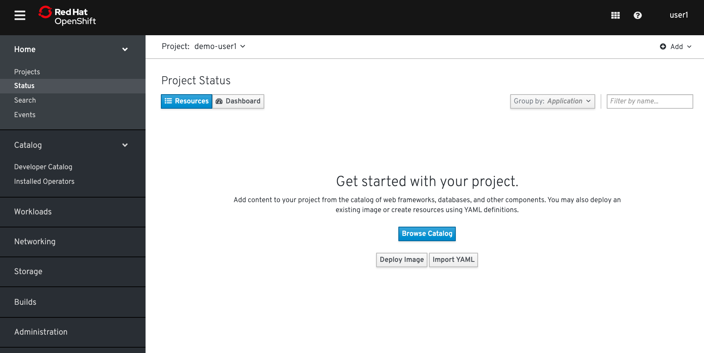
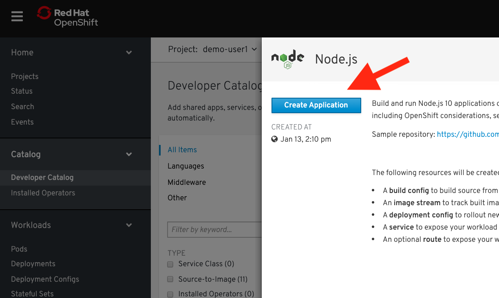
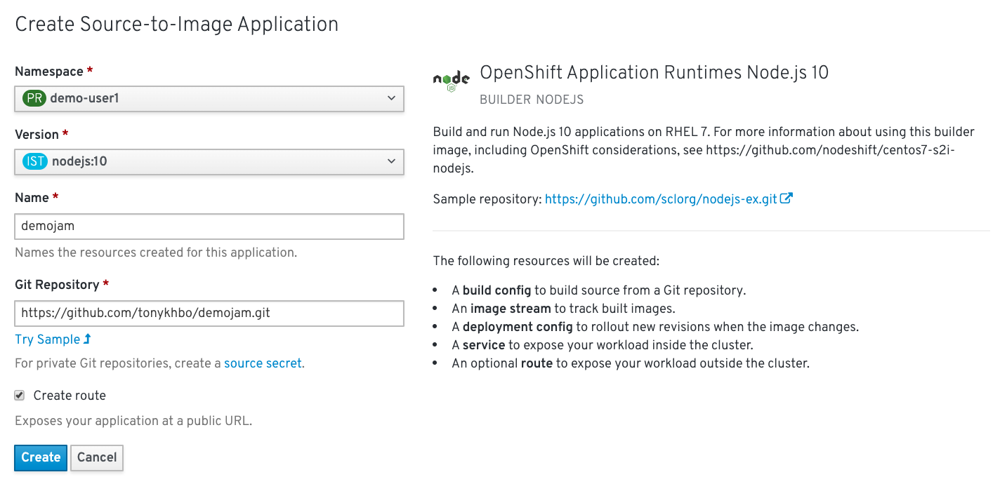

### Source to Image

One of the useful components of OpenShift is its source-to-image capability. S2I is a framework that makes it easy to turn your source code into runnable images. The main advantage of using S2I for building reproducible docker images is the ease of use for developers. You'll see just how simple it can be in this lab.
<br>

When going through this lab, follow either:
```
Option 1 (CLI Instructions)
```
or 
```
Option 2 (Web Console Instructions)
```

#### Let's build a node.js web server using S2i

In this section, we're going to take a [git repo](https://github.com/tonykhbo/demojam) and containerize it using [source to image](https://github.com/openshift/source-to-image). 

##### CLI Instructions (Option 1)

Deploy a new application from Github by running the following commands in the terminal:

```execute
oc new-app --name=demojam https://github.com/tonykhbo/demojam.git
```

Create a route for the new app:

```execute
oc expose service demojam
```

<br>

##### Web Console Instructions (Option 2)

From the left navbar, navigate to ```Home``` > [Status](%console_url%/overview/ns/demo-%username%). If you properly deleted all your project's resources in the previous lab, you should have a view like this:



Click on ```Browse Catalog```. Find ```NodeJS```, select it, and click on ["Create Application"](%console_url%/catalog/source-to-image?imagestream=nodejs&imagestream-ns=openshift&preselected-ns=demo-%username%): 



Set the ```Name``` for your project as demojam. Set the ```Git Repository``` as: 

```
https://github.com/tonykhbo/demojam.git
```

Enable "Create route", leave the rest as default, and click "Create":



#### Check out the build details

We can see the details of what the S2I builder did. This can be helpful to diagnose issues if builds are failing.

<br>

##### CLI Instructions (Option 1)

At the terminal, run the following commands:

```execute
oc get builds
```

Note the name of your build from the above command output and use it to see the logs with:

```
oc logs builds/[BUILD_NAME]
```

<br>

##### Web Console Instructions (Option 2)

On the left navbar, navigate to ```Builds``` > [Builds](%console_url%/k8s/ns/demo-%username%/builds):


Select ```demojam-1``` and navigate to [Logs](%console_url%/k8s/ns/demo-%username%/builds/demojam-1/logs)


#### See the App in Action

Let's see this app in action!

##### CLI Instructions (Option 1)

In the terminal, get the route by running:

```execute
oc get routes
```

<br>

##### Web Console Instructions (Option 2)

From the left navbar, navigate to ```Home``` > [Status](%console_url%/overview/ns/demo-%username%). 

Click on ```demojam,#1``` and a panel on the rightside of the browser will appear with information about your pod. Click ```Resources``` and go down to ```Routes``` to access your demojam app url:


Your url should be similar to this: 

```
http://demojam-demo-%username%.%cluster_subdomain%
```

The app should look like this in your web browser:


Keep the app running, we're going to use it in the next lab!

#### Summary

In this lab we deployed a sample application using source to image. This process built our code and wrapped that in a docker image. It then deployed the image into our OpenShift platform in a pod and exposed a route to allow outside web traffic to access our application. In the next lab we will look at some details of this app's deployment and make some changes to see how OpenShift can help to automate our development processes. 