### Developing and Managing the App

In this lab we will explore some of the common activities undertaken by developers working in OpenShift. You will become familiar with how to use environment variables, secrets, build configurations, and more. Let's look at some of the basic things a developer might care about for a deployed app.

#### See the app in action and inspect some details

There is no more ambiguity or confusion about where the app came from. OpenShift provides traceability for your running deployment back to the docker image and the registry it came from, as well as (for images built by OpenShift) back to the exact source code branch and commit. Let's take a look at that.

##### *CLI Instructions (Option 1)*

See the status of your current project. In this case it will show the demojam service (svc) with a nested deployment config (dc) along with some more info that you can ignore for now
In the terminal run the following command:

```execute
oc status
```

Notice under the template section it lists the containers it wants to deploy along with the path to the container image:

```execute
oc describe dc/demojam
```

>There are a few other ways you could get to this information. If you are feeling adventurous, you might want to: describe the replication controller ```oc describe rc -l app=demojam```, the image stream ```oc describe is -l app=demojam``` or the running pod itself ```oc describe pod -l app=demojam```

Because we built this app using S2I, we get to see the details about the build - including the container image that was used for building the source code. So let's find out where the image came from. Here are the steps to get more information about the build configuration (bc) and the builds themselves.

Lets find out more about our build config (bc)

```execute
oc describe bc/demojam
```

>Notice the information about the configuration of how this app gets built. In particular look at the github URL, the webhooks you can use to automatically trigger a new build, the docker image where the build runs inside of, and the builds that have been completed. New let's look at one of those builds.

Run the following command to view the docker image where the build runs inside of:

```execute
oc describe build/demojam-1
```

>This shows us even more about the deployed container's build and source code including exact commit GUID for this build. We can also can see the commit's author, and the commit message. You can inspect the code by opening a web browser and pointing it to: https://github.com/tonykhbo/demojam/commit/[COMMIT_GUID]

<br>

##### *Web Console Instructions (Option 2)*

From the left navbar, navigate to ```Home``` > [Status](%console_url%/overview/ns/demo-%username%). Click on "Overview" to see more details about your demojam application:

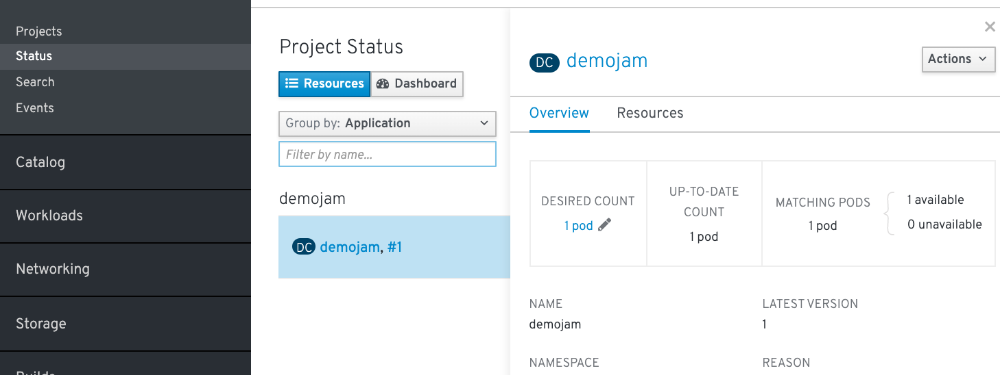

On the left navbar, navigate to ```Builds``` > [Builds Config](%console_url%/k8s/ns/demo-%username%/buildconfigs). Find the demojam build config, it should look like this:

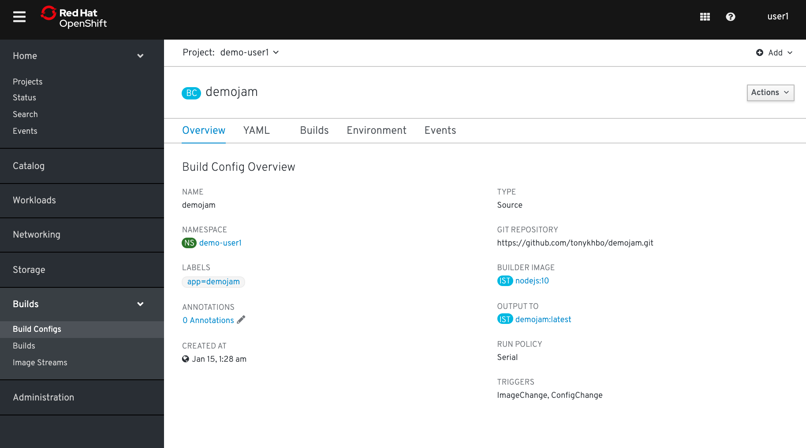

Next, click on the ```Builds``` tab between ```YAML``` and ```Environment``` or navigate to ```Builds``` > [Builds](%console_url%/k8s/ns/demo-%username%/builds) from the left navbar

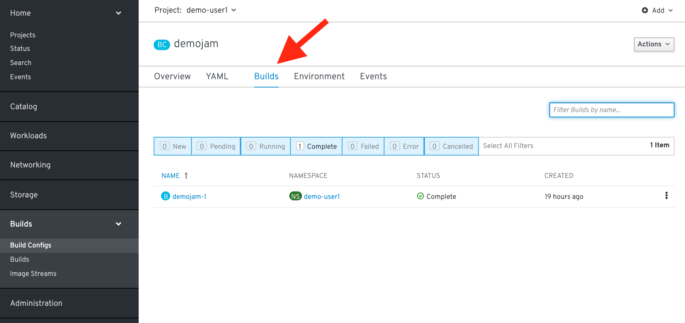

Click on demojam-1. Because we built this app using S2I, we get to see the details about the build - including the container image that was used for building the source code. 

>Note that you can kick-off a rebuild here if something went wrong with the initial build and you'd like to attempt it again.

Here you can also see the author's latest commit and comment:

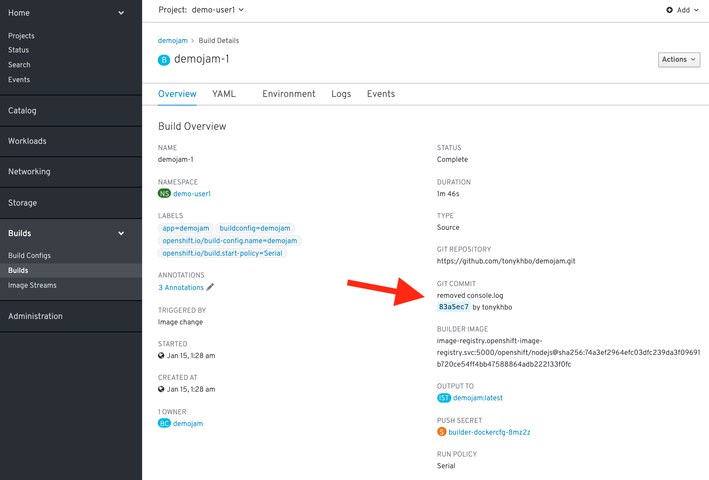

You can take the commit GUID and add it to this URL: 

```
https://github.com/tonykhbo/demojam/commit/[COMMIT_GUID] 
```

to see the specific change. 

<br>

#### Pod Logs

In the S2I lab we looked at a build log to inspect the process of turning source code into an image. Now let's inspect the log for a running pod - in particular let's see the web application's logs.

##### *CLI Instructions (Option 1)*

In the terminal, run the following to see the basic details of all the pods in this project (including the builders):

```execute
oc get pods
```

Let's look at the pod running our application. Look for the ```POD NAME``` that that is ```Running``` you will use it below.

```
oc logs [POD NAME]
```

You will see in the output details of your app starting up and any status messages it has reported since it started.

>You can see more details about the pod itself with ```oc describe pod [POD NAME]```

Example: 

```
[user1:~] $ oc get pods
NAME               READY   STATUS      RESTARTS   AGE
demojam-1-build    0/1     Completed   0          19h
demojam-1-deploy   0/1     Completed   0          19h
demojam-1-wrfvb    1/1     Running     1          19h
```

```
[user1:~] $ oc describe pod demojam-1-wrfvb
Name:               demojam-1-wrfvb
Namespace:          demo-user1
Priority:           0
PriorityClassName:  <none>
Node:               ip-10-0-142-68.ec2.internal/10.0.142.68
Start Time:         Wed, 15 Jan 2020 06:30:04 +0000
Labels:             app=demojam
                    deployment=demojam-1
                    deploymentconfig=demojam
...
```

##### *Web Console Instructions (Option 2)*

On the left navbar, click ```Workloads``` > [Pods](%console_url%/k8s/ns/%project_namespace%/pods). This is going to show basic details for all pods in this project:


You can see other pods from other projects by clicking on the dropdown and selecting the corresponding project.


Let's click on the pod for our demojam application. Here you see the status details of your pod as well as its configuration. Take a minute here and look at what details are available.

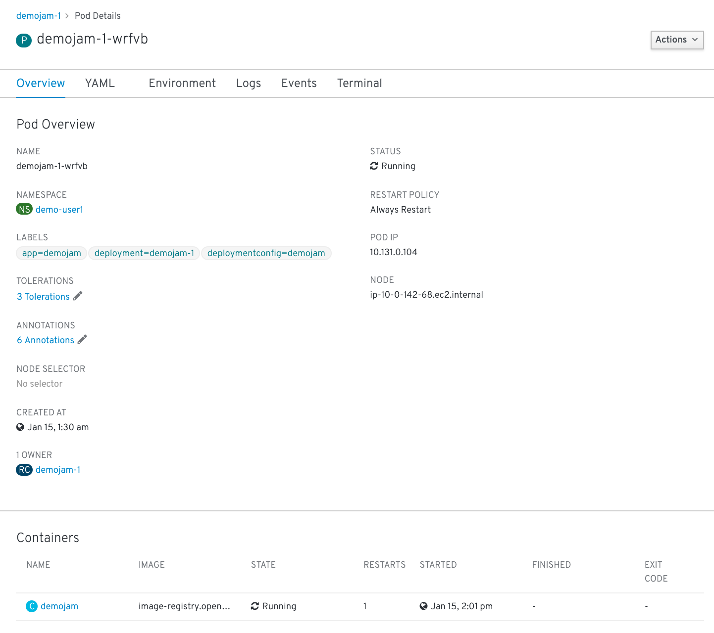

Next, click the ```Logs``` tab between ```Environment``` and ```Events```. See in the output window the details of your app starting up and any status messages it has reported since it started:

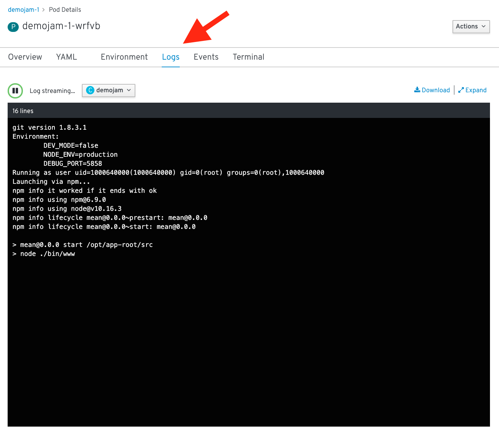

<br>

#### Let's set some environment variables?

Whether it's a database name or a configuration variable, most applications make use of environment variables. It's best not to bake these into your containers because they do change and you don't want to rebuild an image just to change an environment variable. Good news! You don't have to. OpenShift let's you specify environment variables in your deployment configuration and they get passed along through the pod to the container. Let's try doing that.

##### *CLI Instructions (Option 1)*

Let's have a little fun. The app has some easter eggs that get triggered when certain env vars are set to 'true'.

```execute
oc set env dc/demojam -e MYSTERY=true
```

Due to the deployment config strategy being set to ```Rolling``` and the ```ConfigChange``` trigger being set, OpenShift auto deployed a new pod as soon as you updated with the env variable. If you were quick enough you saw this happening with the get pods command. The ```-w``` flag lets you watch the pods.

```
oc get pods -w
```

>Press Ctrl+C to stop watching the pods

You can set env variables across all deployment configs with ```dc --all``` instead of specifying a specific config

Example:
```
oc set env dc --all -e MYSTERY=true
```

<br>

##### *Web Console Instructions (Option 2)*

On the left navbar, click on ```Workload``` > [Deployment Config](%console_url%/k8s/ns/demo-%username%/deploymentconfigs). This is going to show basic details for all deployment configurations in this project: 

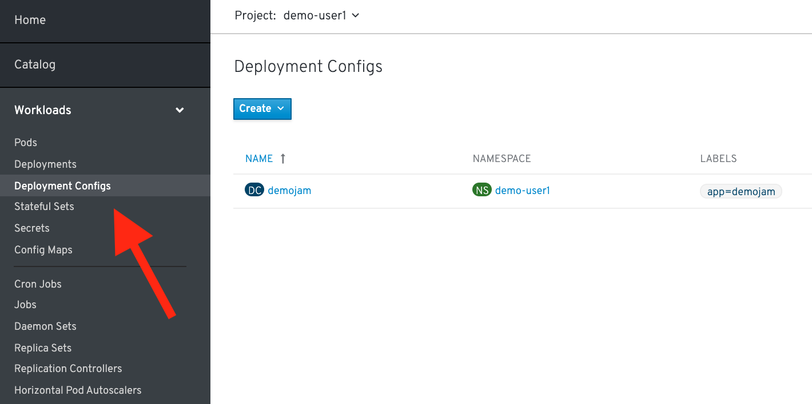

Click the "demojam" deployment config:

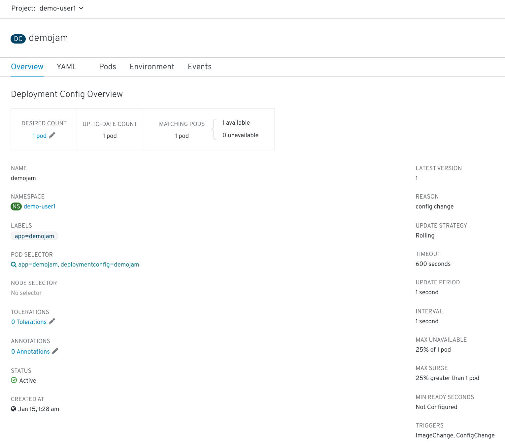

There are a lot of details here, feel free to check them out and ask questions, but we are here to set some new environment variables.

Click on the ```Environment``` tab next to the ```Pods``` tab:

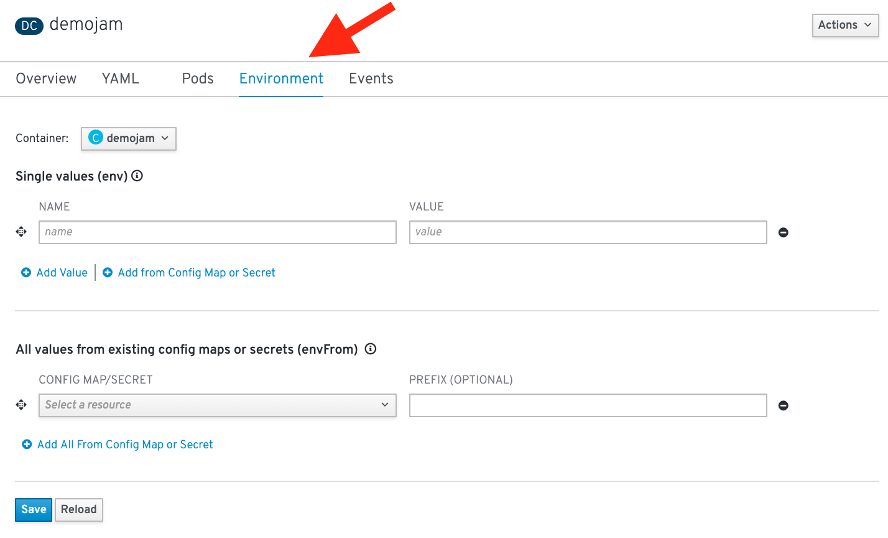

Add an environment variable with the name ```MYSTERY``` and a value of ```true```. Click ```Save```:

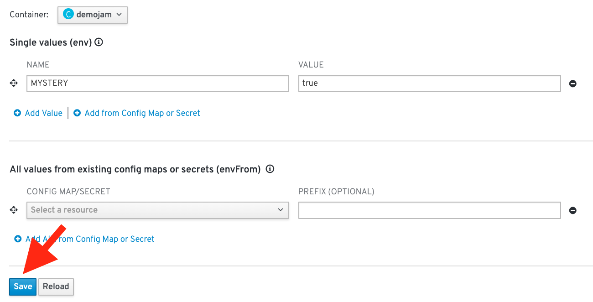

If you are quick enough you will see a new pod spin up and an the old pod spin down. This is due to the deployment config strategy being set to ```Rolling``` and having a ```ConfigChange``` trigger, OpenShift auto deployed a new pod as soon as you updated with the env variable.

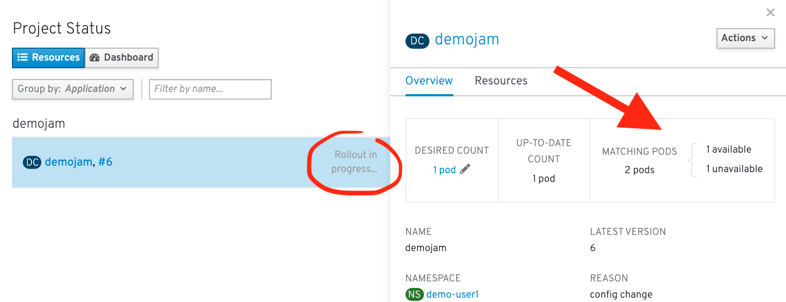

With the new environment variables set, Navigate to your [app](http://demojam-demo-%username%.%cluster_subdomain%/#/sprint) should look like this in your web browser (the play button will become green): 

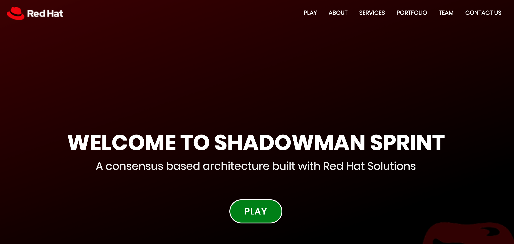

<br>

#### Getting into a pod

There are situations when you might want to jump into a running pod, and OpenShift lets you do that pretty easily. We set some environment variables and secrets in this lab, let's jump onto our pod to inspect them.

##### *CLI Instructions (Option 1)*

In the terminal run the following command:

```execute
oc get pods
```

Find the pod name for your Running pod:

```
oc exec -it [POD NAME] /bin/bash
```

You are now interactively attached to the container in your pod. Let's look for the environment variables we set:

```execute
env | grep MYSTERY
```
That should return the ```MYSTERY=true``` matching the value that we set in the deployment config.

```execute
exit
```
<br>

##### *Web Console Instructions (Option 2)*

On the left navbar, click on ```Workload``` > [Pods](%console_url%/k8s/ns/demo-%username%/pods). Select our demojam pod: 


Click on the "Terminal" tab at the top next to "Events. 

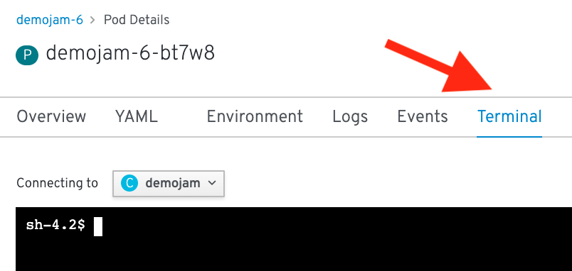

Inside the web page's terminal type: 

```
env | grep MYSTERY
```

That should return the ```MYSTERY=true``` matching the value that we set in the deployment config:


<br>

#### Good work, let's clean this up

Let's clean up all this to get ready for the next lab:

```execute
oc delete all -l app=demojam
```

<br>

#### Summary

In this lab you've seen how to trace running software back to its roots, how to see details on the pods running your software, how to update deployment configurations, how to inspect logs files, how to set environment variables consistently across your environment, and how to interactively attach to running containers. All these things should come in handy for any developer working in an OpenShift platform.
