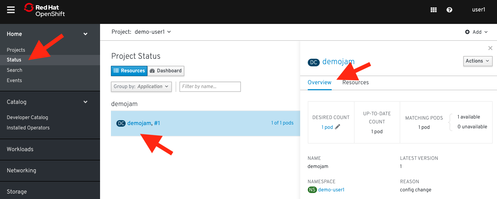
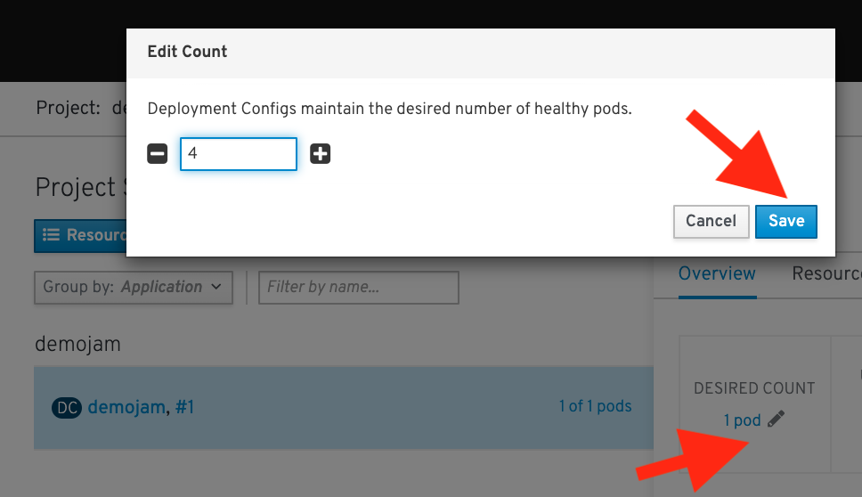
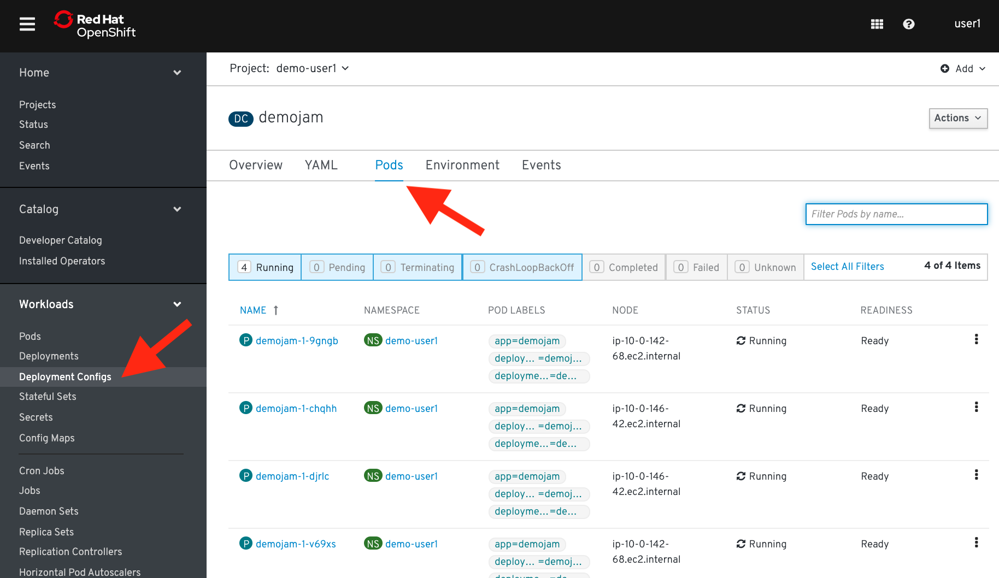
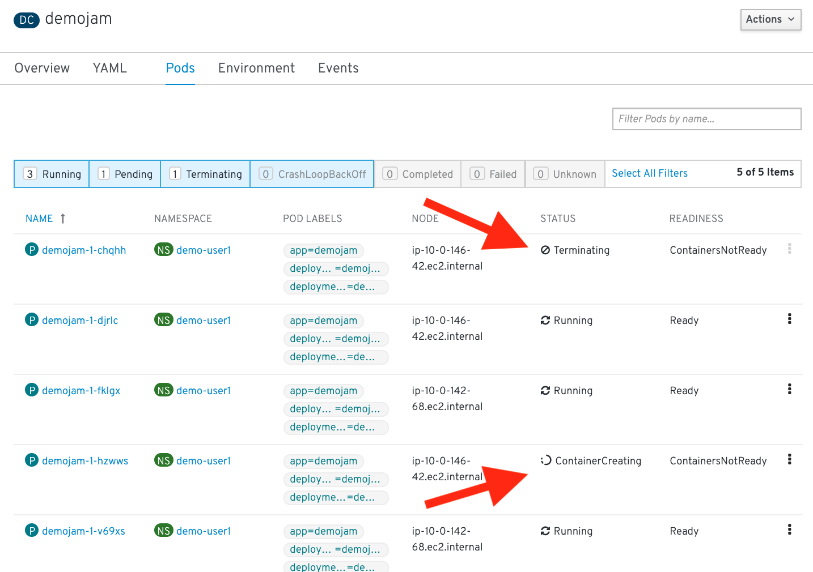
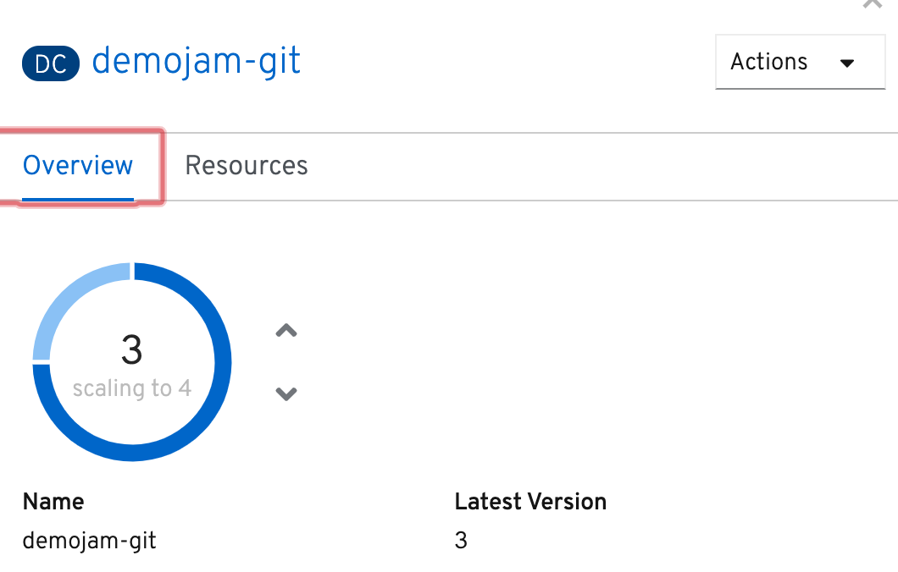
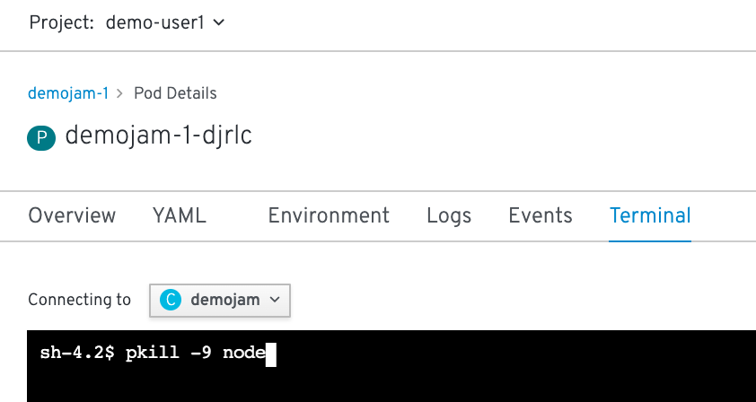
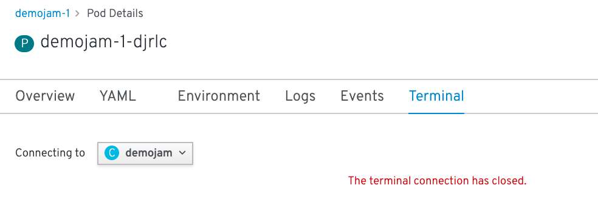
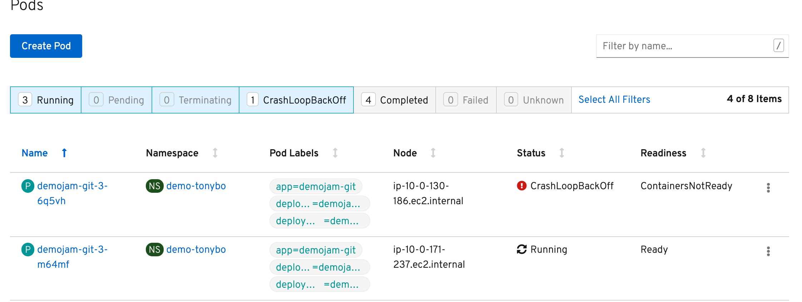

### Replication and Recovery

#### Things will go wrong, that's why we have replication and recovery

Things will go wrong with your software, or your hardware, or from something out of your control. But we can plan for that failure, and planning for it let's us minimize the impact. OpenShift supports this via what we call replication and recovery.

##### Replication

Let's walk through a simple example of how the replication controller can keep your deployment at a desired state. Assuming you still have the dc-metro-map project running we can manually scale up our replicas to handle increased user load.

##### *CLI Instructions (Option 1)*

Try the following command in the terminal:

```execute
oc scale --replicas=4 dc/demojam
```

Check out the new pods: 

```execute
oc get pods
```

Notice that you now have 4 unique pods availble to inspect. If you want go ahead and inspect them, using 'oc describe pod/', you can see that each have their own IP address and logs.

##### *Web Console Instructions (Option 2)*

In the Admin View, click on "Project View", and then select your project.

Click on the Workload Tab at the top, then click Overview on the right side pane that pops up: 



Underneath overview, click the up arrows 3 times. The deployment should indicate that it is scaling to 4 pods, and eventually you will have 4 running pods. Keep in mind that each pod has it's own container which is an identical deployment of the webapp. OpenShift is now (by default) round robin load-balancing traffic to each pod.



Hover over the pod counter (the circle). Notice that you now have 4 unique webapp pods available to inspect. 

Click on the "Resources" tab next to "Overview" if you want go ahead and inspect them. You can see that each have their own IP address and logs.



So you've told OpenShift that you'd like to maintain 4 running, load-balanced, instances of our web app.

#### Recovery

Okay, now that we have a slightly more interesting replication state, we can test a service outages scenario. In this scenario, the dc-metro-map replication controller will ensure that other pods are created to replace those that become unhealthy. Let's force inflict an issue and see how OpenShift reponds.

##### *CLI Instructions (Option 1)*

Choose a random pod and delete it:

```execute
oc get pods
```

```
oc delete pod/PODNAME
```

```execute
oc get pods -w
```

If you're fast enough you'll see the pod you deleted go "Terminating" and you'll also see a new pod immediately get created and transition from "Pending" to "Running". If you weren't fast enough you can see that your old pod is gone and a new pod is in the list with an age of only a few seconds.

You can see the more details about your replication controller with:

```execute
oc describe rc
```

<br>

##### *Web Console Instructions (Option 2)*

In the Admin View, click on "Project View", and then select your project.

Click on the Workload Tab at the top, then click on the "Resources" tab to see all of your running pods.


Click one of the running pods. Click the "Actions" button in the top right and then select "Delete":



Confirm deletion, and quickly switch back to the Overview tab. If you're fast enough you'll see the pod you deleted unfill a portion of the deployment circle, and then a new pod fill it back up.



You can browse the pods list again to see the old pod was deleted and a new pod. 

<br>

#### Application Health

In addition to the health of your application's pods, OpenShift will watch the containers inside those pods. Let's force inflict some issues and see how OpenShift reponds.

##### *CLI Instructions (Option 1)*

Choose a running pod and shell into it:

```execute
oc get pods
```

```
oc exec PODNAME -it /bin/bash
```

You are now executing a bash shell running in the container of the pod. Let's kill our webapp and see what happens.

> If we had multiple containers in the pod we could use "-c CONTAINER_NAME" to select the right one

```
pkill -9 node
```

This will kick you out off the container with an error like: 

```
command terminated with exit code 137
```

Do it again - shell in and execute the same command to kill node
Try to shell in again after the command, and you should see this message instead 
```
error: unable to upgrade connection: container not found
```

Watch for the container restart
```execute
oc get pods -w
```

If a container dies multiple times quickly, OpenShift is going to put the pod in a CrashBackOff state. This ensures the system doesn't waste resources trying to restart containers that are continuously crashing.

<br>

##### *Web Console Instructions (Option 2)*

Navigate to browse the pods list in your Project, and click on a running pod

In the tab bar for this pod, click on "Terminal"

Click inside the terminal view and type 

```
pkill -9 node
```



This is going to kill the node.js web server and kick you off the container.



Click the refresh button (on the browser) and do that a couple more times.

Go back to the pods list.



The container died multiple times so quickly that OpenShift is going to put the pod in a CrashBackOff state. This ensures the system doesn't waste resources trying to restart containers that are continuously crashing.

<br>

#### Clean up

Let's scale back down to 1 replica. If you are using the web console just click the down arrow from the Overview page. If you are using the command line use the "oc scale" command.

<br>

#### Summary

In this lab we learned about replication controllers and how they can be used to scale your applications and services. We also tried to break a few things and saw how OpenShift responded to heal the system and keep it running. This topic can get deeper than we've experimented with here, but getting deeper into application health and recovery is an advanced topic.