### CI/CD Defined

In modern software projects many teams utilize the concept of Continuous Integration (CI) and Continuous Delivery (CD). By setting up a tool chain that continuously builds, tests, and stages software releases, a team can ensure that their product can be reliably released at any time. OpenShift can be an enabler in the creation and management of this tool chain.

In this lab we walk through creating a simple example of a CI/CD pipeline utlizing Jenkins, all running on top of OpenShift! The Jenkins job will trigger OpenShift to build and deploy a test version of the application, validate that the deployment works, and then tag the test version into production.

#### Create a New Project

##### *CLI Instructions (Option 1)*

Create the project, ```cicd-%username%```

```execute
oc new-project cicd-%username%
```

##### *Web Console Instructions (Option 2)*

On the left navbar, click on ```Home``` > [Projects](%console_url%/k8s/cluster/projects). 

Click on ```Create Project``` and name it ```cicd-%username%```: 

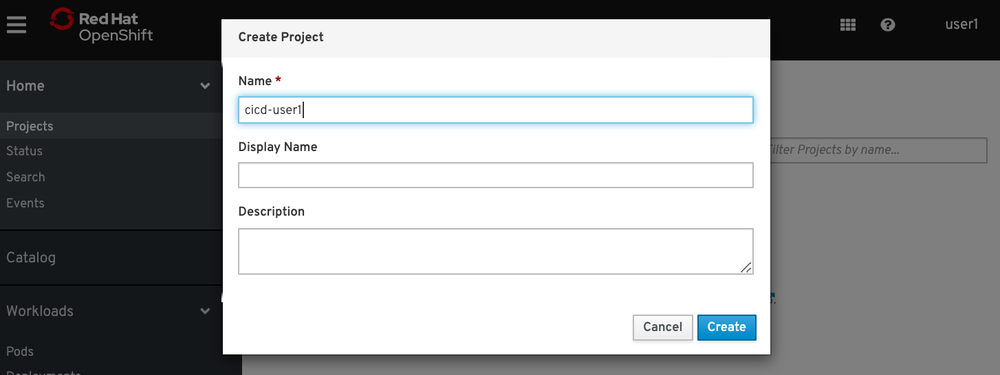

<br>

#### Instantiate a Jenkins server in your project

<!-- ##### *CLI Instructions (Option 1)* -->

Make sure you're in the correct project namespace:

```execute
oc project cicd-%username%
```

Run this command to create a ephemeral jenkins application: 

```execute
oc new-app jenkins-ephemeral
```

<!-- ##### *Web Console Instructions (Option 2)*

Inside ```Home``` > [Status](%console_url%/overview/ns/cicd-%username%). Click on ```Browse Catalog```:

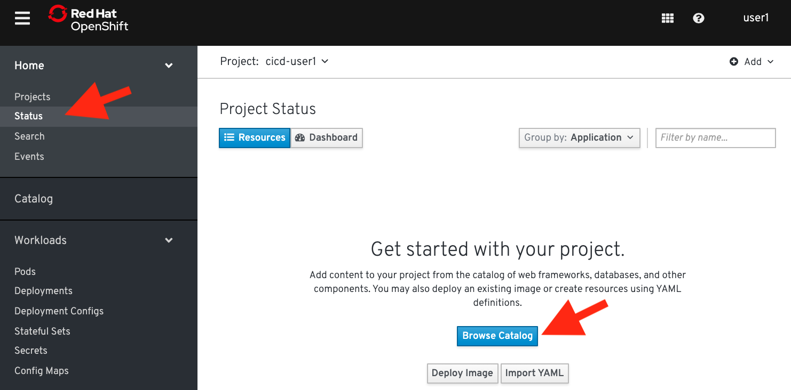

Find ```NodeJS```, select it, and click on ["Create Application"]

Then click on "+Add" and then click on "From Catalog": 


In the catalog, search for jenkins or scroll down to find it: 

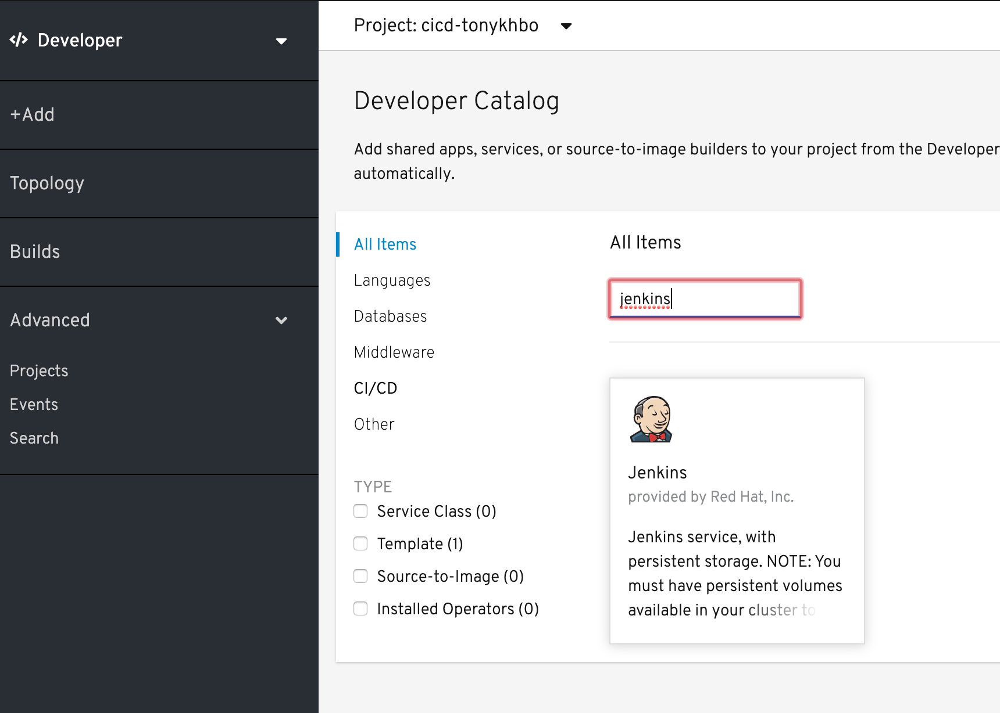

Click on Jenkins, click "Instantiate Template". 

Change Memory Limits to 512Mi and leave the rest of the fields as the default: 

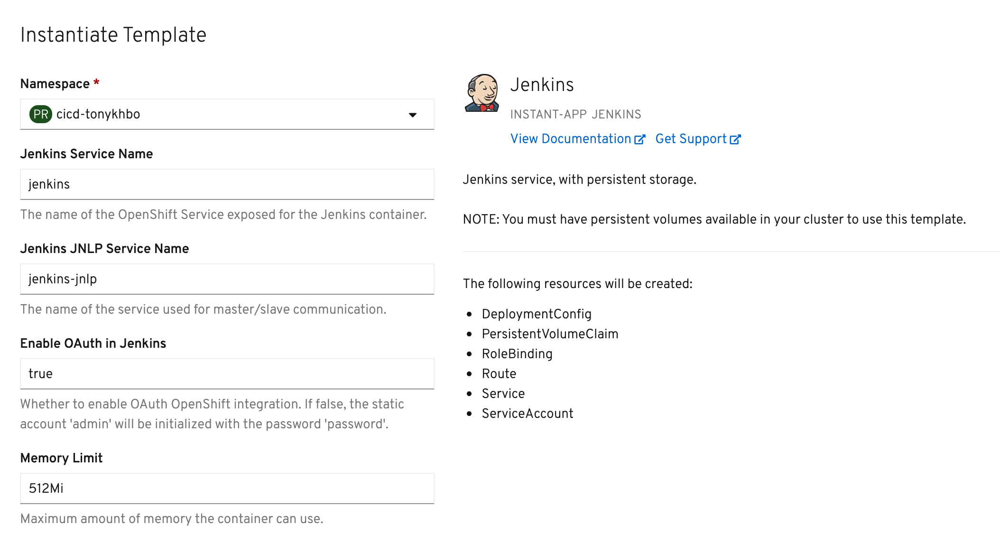

Click "Create" at the bottom

<br> -->

<br>

#### Create a sample application config

##### *CLI Instructions*

Use the "oc new-app" command to create a simple nodejs application from a template file:

```execute
oc new-app -f https://raw.githubusercontent.com/tonykhbo/openshift4-workshop-101/master/nodejs-helloworld.json
```

<!-- ##### *Web Console Instructions (Option 2)*

View available in catalog

From the Developer View, select your project, cicd-%username%.

Then click on "+Add" and then click on "YAML"

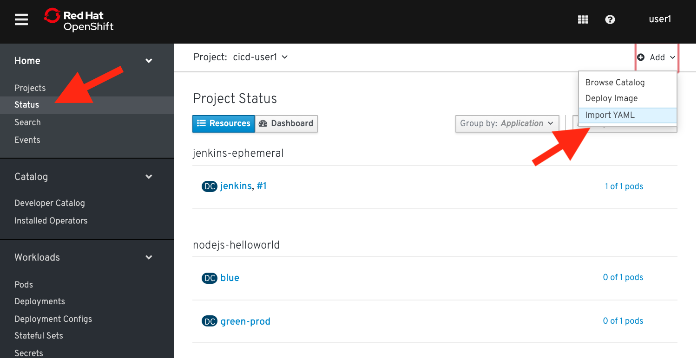

Navigate to https://raw.githubusercontent.com/tonykhbo/ocp4-workshop-101/master/nodejs-hellworld.json

Copy the contents of the raw .json file and paste it into Openshift:

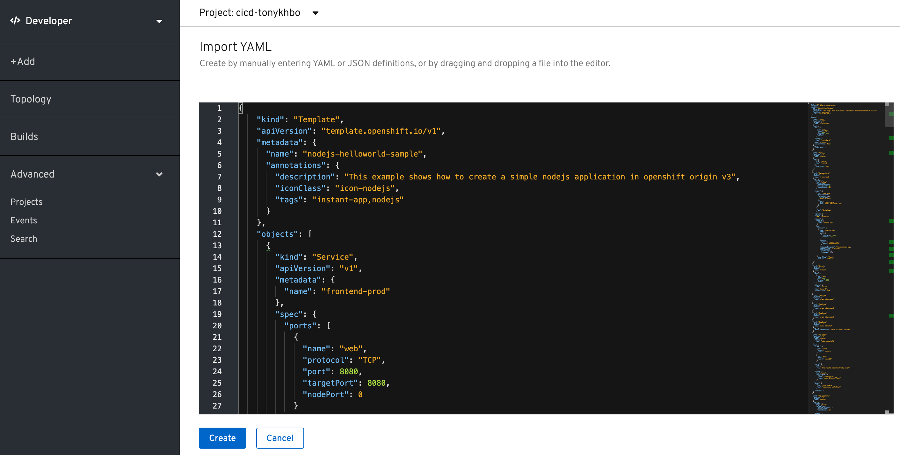 -->

From the left navbar, navigate to ```Home``` > [Status](%console_url%/overview/ns/cicd-%username%). 

<!-- Click on your [cicd-%username%](%console_url%/overview/ns/cicd-%username%)
project.  -->

You should see the jenkins-persistent app and the nodejs-helloworld app: 

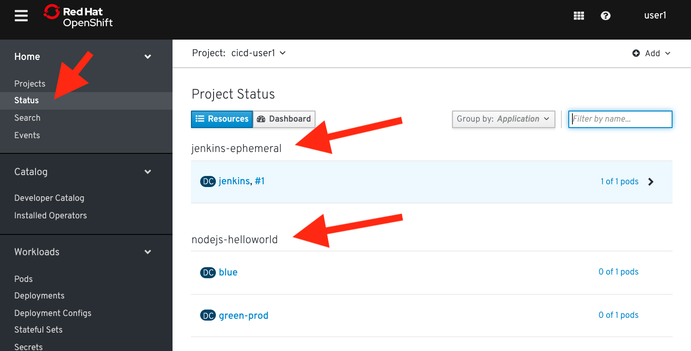


#### Get Jenkins route

Next we're going to get the url to access our new ephemeral jenkins server.

##### *CLI Instructions (Option 1)*

Get the route to the Jenkins server. 

```execute
oc get route
```

Your ```HOST/PORT``` values will differ from the example below:

```
tonybo@macbook-2 ~ % oc get route
NAME       HOST/PORT                                                            PATH   SERVICES   PORT    TERMINATION     WILDCARD
frontend   frontend-cicd-tonykhbo.apps.us-east-1.starter.openshift-online.com          frontend   <all>   edge            None
jenkins    jenkins-cicd-tonykhbo.apps.us-east-1.starter.openshift-online.com           jenkins    <all>   edge/Redirect   None
```

##### *Web Console Instructions (Option 2)*

Inside ```Home``` > [Status](%console_url%/overview/ns/cicd-%username%). Click on the ```(DC) jenkins``` resource. Then, look for ```Routes``` under the ```Resource``` tab.

It should look like this:

```
https://jenkins-cicd-%username%.%cluster_subdomain%
```

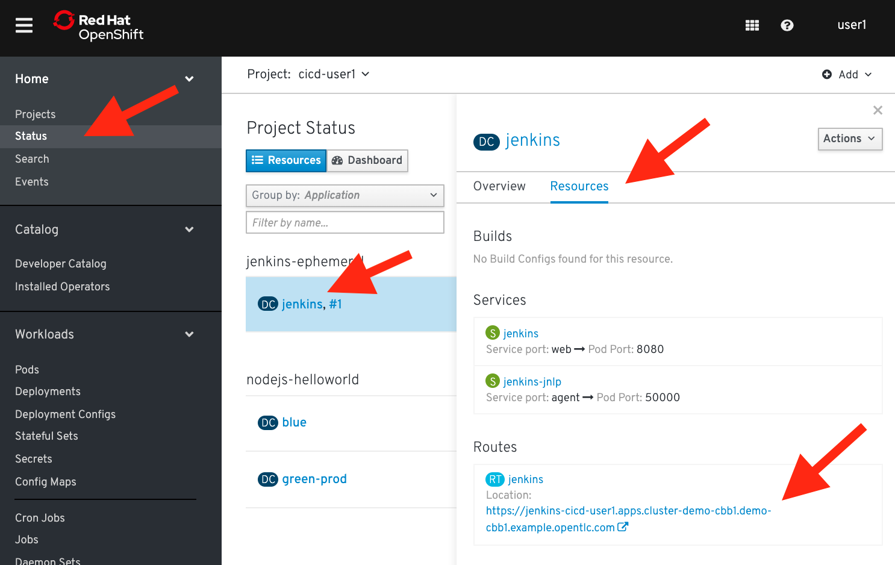

Navigate to this url in your browser.

#### Log into Jenkins

Select ```Login with Openshift``` from the jenkins login page:


Click the ```Allow selected permissions``` button and you should be brought to the jenkins dashboard

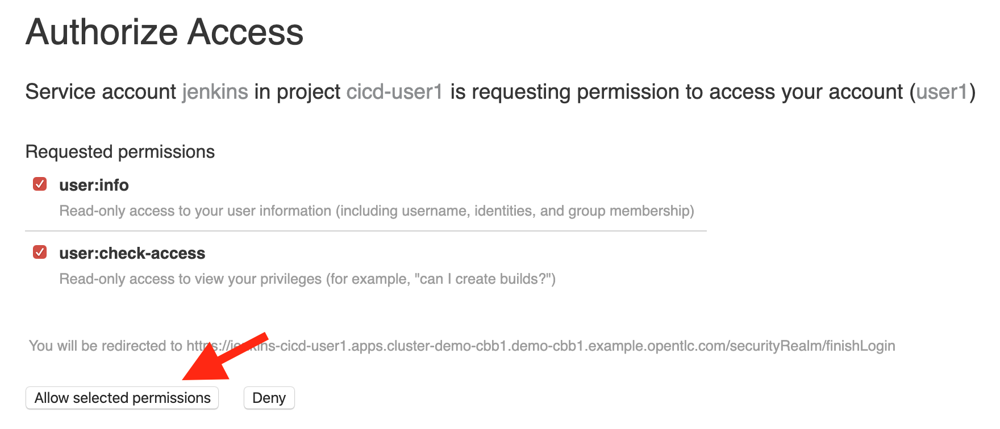

#### Create a Jenkins pipeline using Openshift

We will be creating the following very simple (4) stage Jenkins pipeline.

Build the application from source.
Deploy the test version of the application.
Submit for approval, then tag the image for production, otherwise abort.
Scale the application.
The first step is to create a build configuration that is based on a Jenkins pipeline strategy. The pipeline is written in the GROOVY language using a Jenkins file format.

##### *CLI Instructions (Option 1)*

Run the following inside your terminal tab:


```execute
oc create -f - <<EOF
kind: "BuildConfig"
apiVersion: "build.openshift.io/v1"
metadata:
  name: "pipeline"
spec:
  strategy:
    jenkinsPipelineStrategy:
      jenkinsfile: |-
        pipeline {
          agent any
          stages {
            stage('buildFrontEnd') {
              steps {
                script {
                  openshift.withCluster() {
                    openshift.withProject() {
                      openshift.selector("bc", "blue").startBuild("--wait=true", "--follow")
                    }
                  }
                }
              }
            }
            stage('deployFrontEnd') {
              steps {
                script {
                  openshift.withCluster() {
                    openshift.withProject() {
                      openshift.selector("dc", "blue").rollout().latest()
                    }
                  }
                }
              }
            }
            stage('promoteToProd') {
              steps {
                script {
                  timeout(time: 15, unit: 'MINUTES') {
                    input message: "Promote to PROD?", ok: "Promote"
                  }
                  openshift.withCluster() {
                    openshift.withProject() {
                      openshift.tag("origin-nodejs-sample:latest", "origin-nodejs-sample:prod")
                    }
                  }
                }
              }
            }
            stage('scaleUp') {
              steps {
                script {
                  openshift.withCluster() {
                    openshift.withProject() {
                      openshift.selector("dc", "green-prod").scale("--replicas=2")
                    }
                  }
                }
              }
            }
          }
        }
EOF
```

Expected output:

```
buildconfig.build.openshift.io/pipeline created
```

##### *Web Console Instructions (Option 2)*

Inside ```Home``` > [Status](%console_url%/overview/ns/cicd-%username%).

On the right side, click on ```(+) Add``` and then select ```Import YAML```


Copy the following build configuration definition to your clipboard: 


```
kind: "BuildConfig"
apiVersion: "build.openshift.io/v1"
metadata:
  name: "pipeline"
spec:
  strategy:
    jenkinsPipelineStrategy:
      jenkinsfile: |-
        pipeline {
          agent any
          stages {
            stage('buildFrontEnd') {
              steps {
                script {
                  openshift.withCluster() {
                    openshift.withProject() {
                      openshift.selector("bc", "blue").startBuild("--wait=true", "--follow")
                    }
                  }
                }
              }
            }
            stage('deployFrontEnd') {
              steps {
                script {
                  openshift.withCluster() {
                    openshift.withProject() {
                      openshift.selector("dc", "blue").rollout().latest()
                    }
                  }
                }
              }
            }
            stage('promoteToProd') {
              steps {
                script {
                  timeout(time: 15, unit: 'MINUTES') {
                    input message: "Promote to PROD?", ok: "Promote"
                  }
                  openshift.withCluster() {
                    openshift.withProject() {
                      openshift.tag("origin-nodejs-sample:latest", "origin-nodejs-sample:prod")
                    }
                  }
                }
              }
            }
            stage('scaleUp') {
              steps {
                script {
                  openshift.withCluster() {
                    openshift.withProject() {
                      openshift.selector("dc", "green-prod").scale("--replicas=2")
                    }
                  }
                }
              }
            }
          }
        }
```

Paste this build configuration definition and click ```Create```:

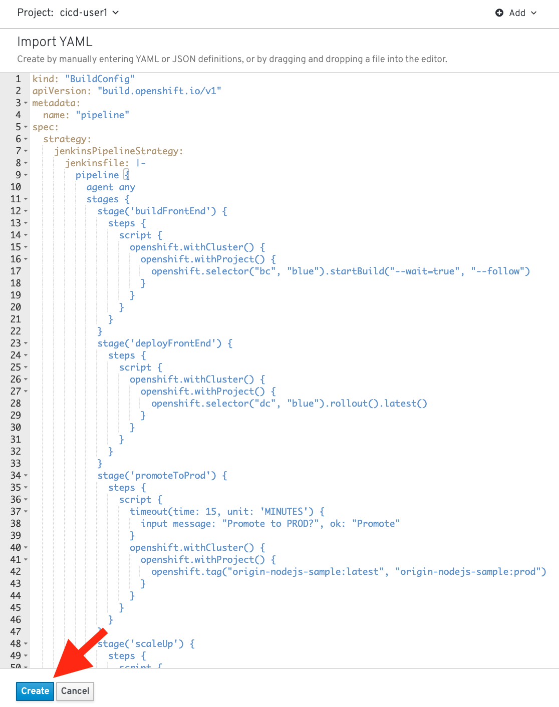

<br>

#### Start the pipeline

From the left navbar, navigate to ```Builds``` > [Builds Config](%console_url%/k8s/ns/cicd-%username%/buildconfigs) > [pipeline](%console_url%/k8s/ns/cicd-%username%/buildconfigs/pipeline): 

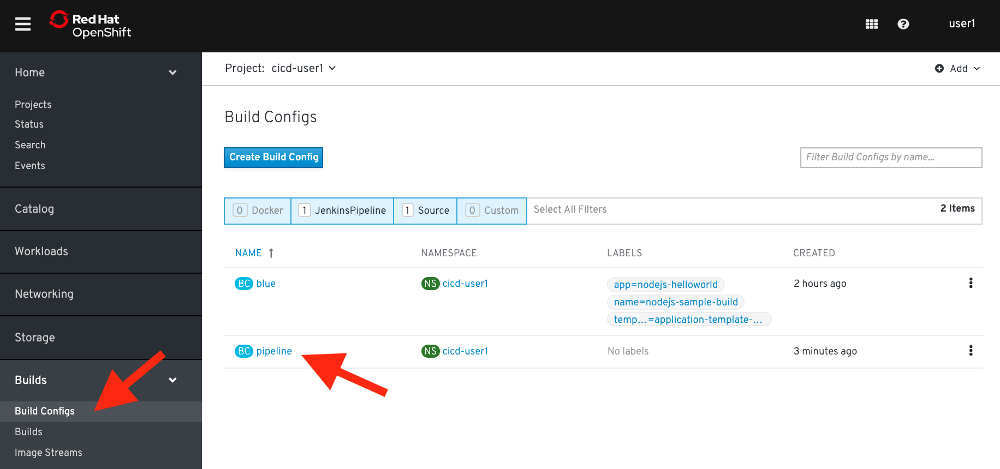

At the top, select the ```Builds``` tab between the ```YAML``` and ```Environments``` tab: 

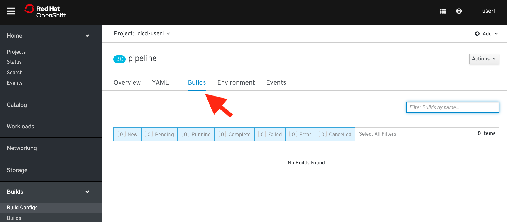

On the right side, click the ```Actions``` dropdown and select ```Start Build```:

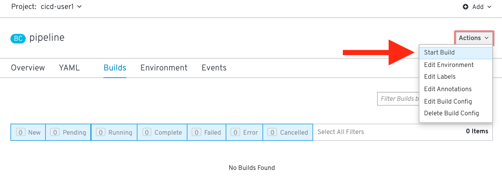

When the pipeline starts, OpenShift uploads the pipeline to the Jenkins server for execution. You should see the build pop up in your build config view: 

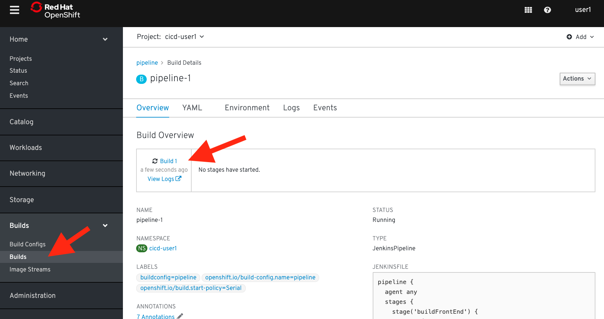


As it runs, the various stages trigger OpenShift to build and deploy the frontend microservice. After a Jenkins user approves the frontend deployment, Jenkins triggers OpenShift to tag the image stream with the ```:prod``` tag then scales the frontend-prod deployment for (2) replicas.

The Jenkins dashboard should indicate that a new build is executing.

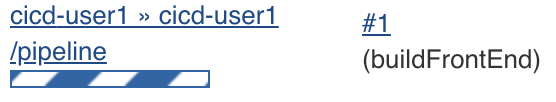

Back in the OpenShift Web Console, watch the pipeline execute. Once the ```deployFrontEnd``` stage completes, you should be able to visit the route for the frontend service in a web browser.

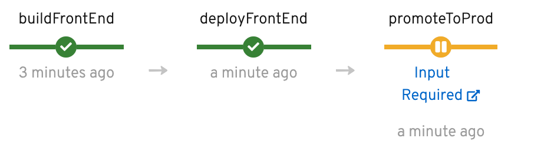

Click on ```Input Required``` and you should get redirected to the Jenkins Web Console to approve the promotion to production.

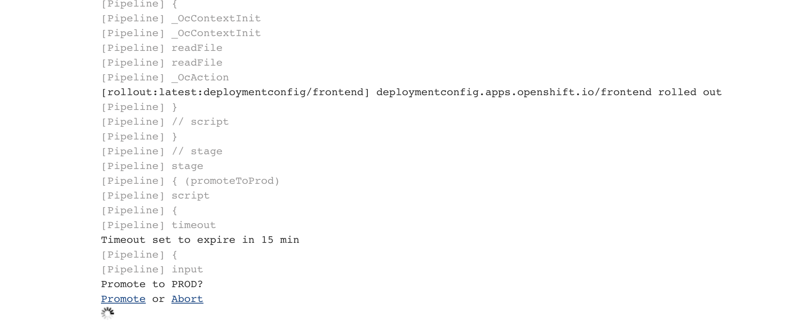

Now return to the OpenShift Web Console and watch the pipeline finish.

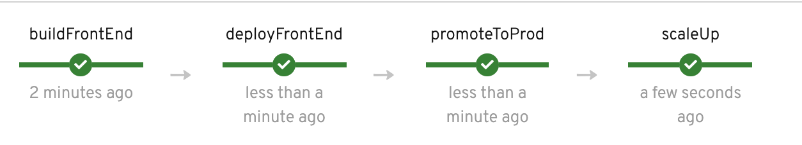

Confirm the ```(dc)green-prod``` has 2 pods deployed.

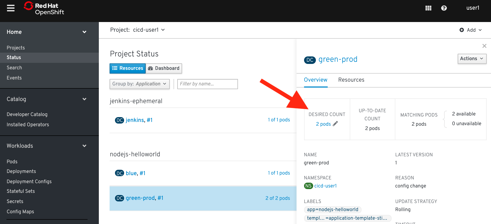


#### Confirm both the test and production services are available

##### *CLI Instructions (Option 1)*

Run the following commands in terminal:

```execute
oc get routes
```

Output should be similar to this:

```
NAME      HOST/PORT                                                                 PATH   SERVICES   PORT    TERMINATION     WILDCARD
color     color-cicd-user1.apps.cluster-demo-cbb1.demo-cbb1.example.opentlc.com            blue       <all>   edge            None
jenkins   jenkins-cicd-user1.apps.cluster-demo-cbb1.demo-cbb1.example.opentlc.com          jenkins    <all>   edge/Redirect   None
```

Use a web browser to visit the HOST/PORT (URLs) for color. It should take you to the blue application. 

##### *Web Console Instructions (Option 2)*

#### Edit the pipeline

Now make a change to the pipeline. For example, in the scaleUp stage, change the number of replicas to 3.

##### *CLI Instructions (Option 1)*

If you are comfortable using the vi editor:

```
oc edit bc/pipeline
```

Modify the replicas in this section from 2 to 3: 

```
stage('scaleUp') {
              steps {
                script {
                  openshift.withCluster() {
                    openshift.withProject() {
                      openshift.selector("dc", "green-prod").scale("--replicas=2")
                    }
                  }
                }
              }
            }
```

Your edits should look like this: ```("--replicas=3")```

##### *Web Console Instructions (Option 2)*

From the left navbar, navigate to ```Builds``` > [Builds Config](%console_url%/k8s/ns/cicd-%username%/buildconfigs) > [pipeline](%console_url%/k8s/ns/cicd-%username%/buildconfigs/pipeline). 

Click on the ```YAML``` tab between the ```Overviews``` and ```Builds``` tab. Change the number of replicas from ```2``` to ```3``` in the YAML configuration and click save:

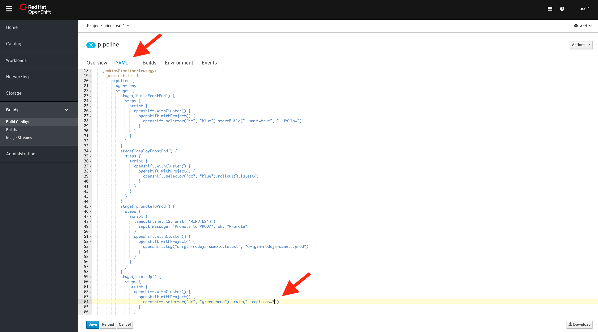

Save your changes and run the pipeline again to confirm the ```green-prod deployment``` has deployed ```3 pods```.

#### Summary

In this lab you have very quickly and easily constructed a basic Build/Test/Deploy pipeline. Although our example was very basic it introduces you to a powerful DevOps feature of OpenShift through the leveraging of Jenkins. This can be extended to support complex real-world continuous delivery requirements. 

