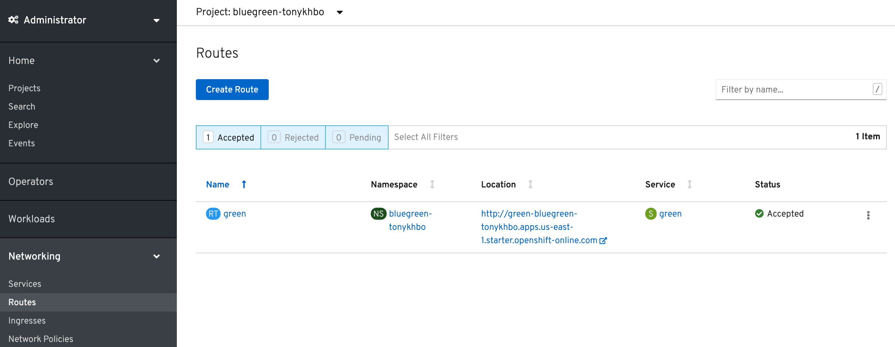
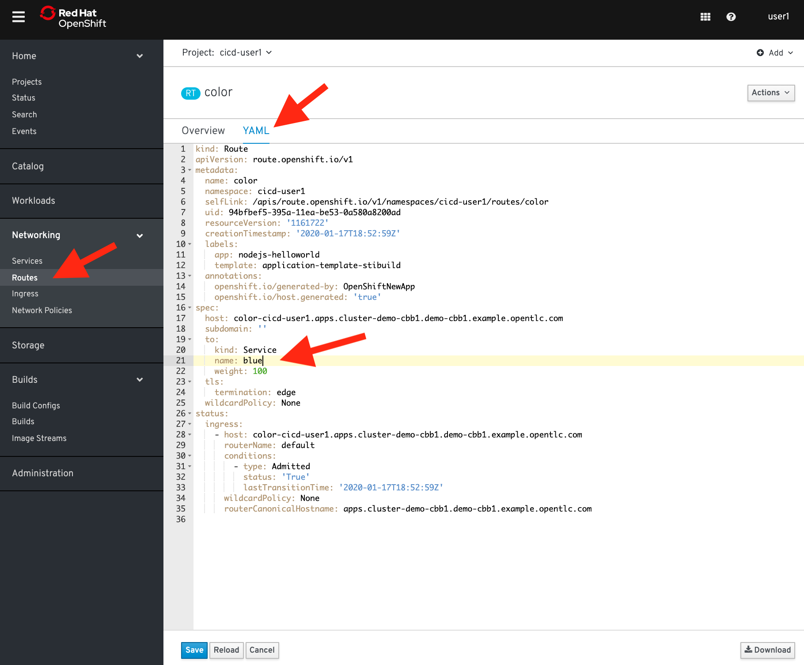

### Blue/Green deployments

When implementing continuous delivery for your software one very useful technique is called Blue/Green deployments. It addresses the desire to minimize downtime during the release of a new version of an application to production. Essentially, it involves running two production versions of your app side-by-side and then switching the routing from the last stable version to the new version once it is verified. Using OpenShift, this can be very seamless because using containers we can easily and rapidly deploy a duplicate infrastructure to support alternate versions and modify routes as a service. In this lab, we will walk through a simple Blue/Green workflow with an simple web application on OpenShift.

#### Before starting

Before we get started with the Blue/Green deployment lab, lets clean up some of the projects from the previous lab.

```execute
oc delete project cicd-%username%
```

#### Lets deploy an application

To demonstrate Blue/Green deployments, we'll use a simple application that renders a colored box as an example. Using your GitHub account, please fork the following https://github.com/tonykhbo/demojam project.

You should be comfortable deploying an app at this point, but here are the steps anyway:

##### *CLI Instructions*: 

Create a new project: 

```execute
oc new-project bluegreen-%username%
```

Create a new app, named green: 

```execute
oc new-app --name=green https://github.com/tonykhbo/demojam
```

Expose your app:

```execute
oc expose service green
```

>Note that we exposed this application using a route named "green". Wait for the application to become available, then navigate to your application and validate it deployed correctly.

Release a new version of our app and test it in the same environment
What we'll do next is create a new version of the application called "blue". The quickest way to make a change to the code is directly in the GitHub web interface. 

In GitHub, edit the public/javascripts/MainCtrl.js file in your repo.

```
angular.module('mean')
.controller('MainCtrl', [
'$scope',
'$http',
'main',
function($scope, $http, main){
    $scope.data = {message: 'Hello'};
    $scope.theColor = "";
   
    main.getChange().then(function(value) {
    	//console.log(angular.lowercase(value));
    	if (angular.lowercase(value) == "true") {
    		$scope.theColor = "green"; <-----------
    	} else {
    		$scope.theColor = "";
    	}
    });

}]);
```
Change the value of *$scope.theColor* from green, to blue :

```
$scope.theColor = "blue"
```

Save the edits. 

These changes will be easily viewable on the main screen of the application. 

Use the same commands to deploy this new version of the app, but this time name the service "blue". No need to expose a new route -- we'll instead switch the "green" route to point to the "blue" service once we've verified it. 

In the terminal, run this command: 

```execute
oc new-app --name=blue https://github.com/tonykhbo/demojam
```

Wait for the "blue" application to become avialable before proceeding.

#### Switch from Green to Blue

Now that we are satisfied with our change we can do the Green/Blue switch. With OpenShift services and routes, this is super simple. Follow the steps below to make the switch:

##### *CLI Instructions (Option 1)*

In the terminal, run the following command:

```execute
oc edit route green
```

This will bring up the Route configuration yaml:

```
...
spec:
  host: green-bluegreen-tonykhbo.apps.us-east-1.starter.openshift-online.com
  port:
    targetPort: 8080-tcp
  subdomain: ""
  to:
    kind: Service
    name: green   <--------------------------
    weight: 100
  wildcardPolicy: None
...
```
Edit the element spec: to: namechange it's value from "green" to "blue".

```
to:
    kind: Service
    name: blue
```


<br>

##### *Web Console Instructions (Option 2)*

In the Admin View of the web console, click on "Networking" on the left hand and then click on "Routes":



Click on the green route and then click on YAML: 



In the Spec section, change *to: name:* from green to blue: 

```
spec:
  host: green-bluegreen-tonykhbo.apps.us-east-1.starter.openshift-online.com
  subdomain: ''
  to:
    kind: Service
    name: blue
    weight: 100
  port:
    targetPort: 8080-tcp
  wildcardPolicy: None
```

Save the changes and navigate to that route and see the change.

#### Summary

Pretty easy, right?

If you want to read more about Blue/Green check out this [post](http://martinfowler.com/bliki/BlueGreenDeployment.html) with a longer description as well as links to additional resources.


