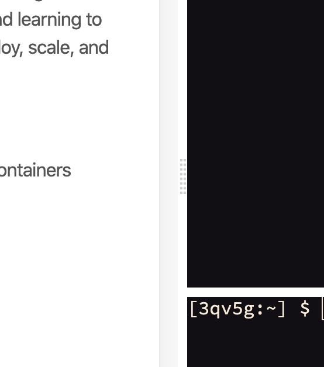

Depending on your browser you can zoom out to get more lab content in the browser by pressing: 

```
ctrl and -
```

There's also a draggable tab in the between the lab and console that lets you re-align the current view:



If you drag it to the right, you will expose the table of contents that'll allow you to easily switch back to a lab if you so desire.

